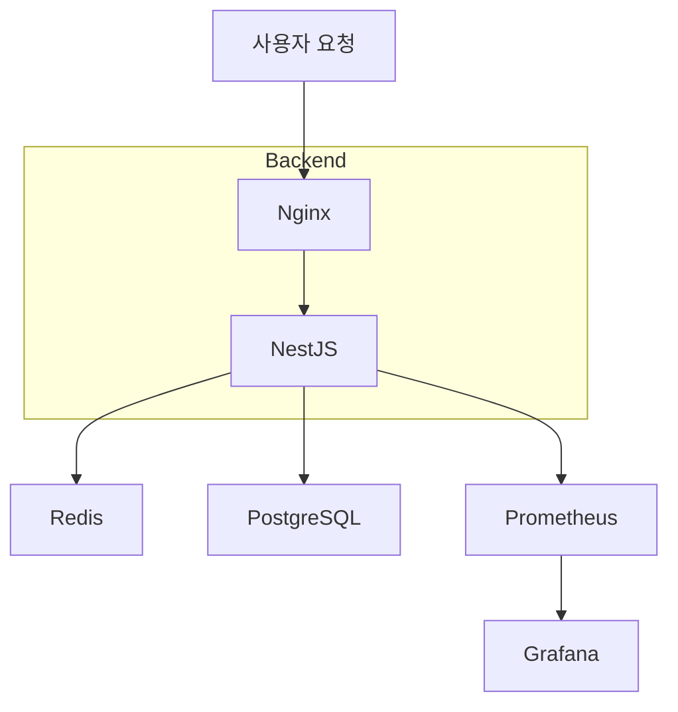
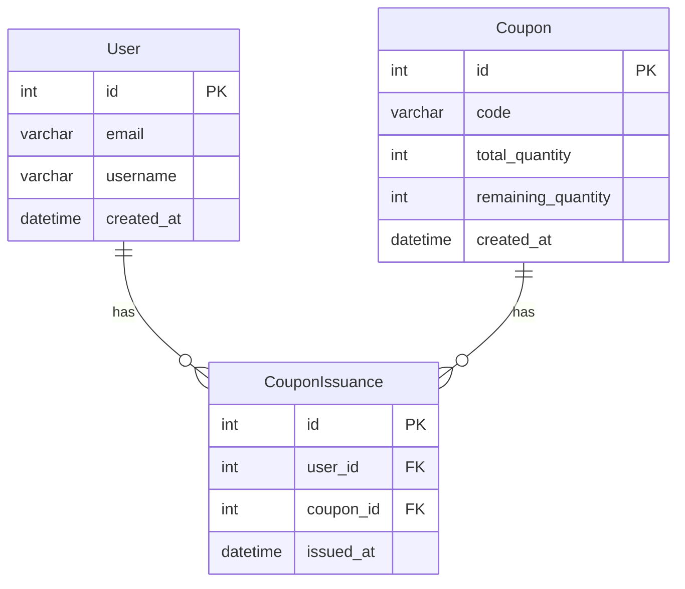

# 🎟️ RushCoupon - 선착순 쿠폰 발행 서비스

> **Redis 분산 락**과 **동시성 이슈**를 해결하는 백엔드 중심의 기술 포트폴리오 프로젝트

---

## 🚀 프로젝트 개요

RushCoupon은 한정된 수량의 쿠폰을 선착순으로 발급하는 서비스로, **실시간 동시성 제어**, **분산 락 처리**, 그리고 **트랜잭션 관리** 등 백엔드 개발자의 필수적인 실무 역량을 깊이 있게 학습하고 증명하는 것을 목표로 합니다.

---

## 🔥 주요 기술적 특징

- Redis를 활용한 **분산 락(Redlock)**을 사용하여 동시 요청 처리
- PostgreSQL의 **트랜잭션 & 낙관적 락(Optimistic Lock)**을 활용한 데이터 일관성 관리
- Nginx 리버스 프록시로 서비스 부하 분산
- 실시간 API 성능 모니터링

---

## 🛠️ 기술 스택

| 분야          | 기술 스택                   | 선택 이유                              |
|---------------|-----------------------------|----------------------------------------|
| Framework     | NestJS (TypeScript)         | 안정적인 아키텍처 및 강력한 타입 시스템 |
| Database      | PostgreSQL                  | 강력한 동시성 처리와 정교한 락 관리 지원 |
| Cache & Lock  | Redis                       | 빠른 캐싱 및 분산 락 처리              |
| Infra         | Docker, Nginx               | 빠른 배포 및 확장성                    |
| CI/CD         | GitHub Actions              | 자동화된 테스트 및 배포                |
| Monitoring    | Prometheus, Grafana        | 시스템 성능 관측 및 모니터링           |

---

## 📌 핵심 기능

- ✅ **쿠폰 발급 API (선착순 제한)**
- ✅ **쿠폰 발급 상태 조회 API**
- ✅ **쿠폰 생성 및 관리 API (관리자용)**
- ✅ **실시간 API 성능 모니터링 (Grafana)**

---

## 🌐 시스템 아키텍처

---

## 📋 ERD 구조

---

## 🚦 동시성 처리 전략

| 이슈 | 처리 방식 | 비고 |
|------|----------|------|
| 선착순 쿠폰 중복 발급 방지 | Redis 분산 락(Redlock) | 발급 API 진입 시 락 획득 |
| 쿠폰 수량 초과 발급 방지 | PostgreSQL 낙관적 락 | 트랜잭션 내에서 재확인 |

---

## 🚨 예상되는 기술적 난제 및 해결 전략

| 난제                  | 해결 전략                          |
|-----------------------|------------------------------------|
| Redis 락 획득 실패    | 재시도 로직 + Timeout 설정         |
| 트랜잭션 실패         | Retry 메커니즘 도입                |
| 과도한 Redis 부하     | Redis 클러스터 및 Replica 구성 고려 |

---

## 📊 성능 모니터링 지표 (Prometheus & Grafana)

- 초당 쿠폰 발급 처리량
- API 평균 응답 시간 및 에러율
- Redis 락 획득 시간 및 실패율

---

## 🚧 향후 개선 및 확장 아이디어

- 멀티 쿠폰 유형 지원
- 사용자별 쿠폰 사용 통계 제공
- 쿠폰 만료 로직 추가
- Discord 알림 연동

---

## 💡 기대 효과

- 동시성 이슈 해결 능력 증명
- 실제 서비스 배포와 유사한 실무 경험 확보
- 간결하고 확장 가능한 백엔드 아키텍처 설계 능력 입증
